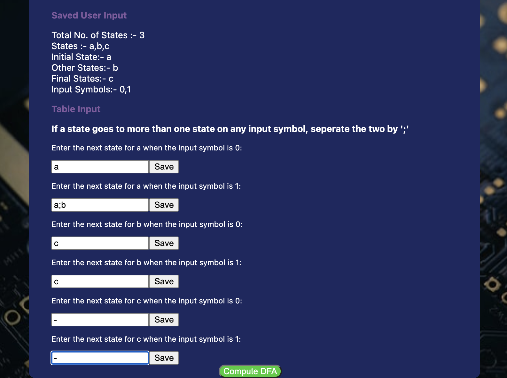

# NFA_to_DFA_Extension 

## Project Description
The project NFA_to_DFA_Extension is a chrome extension that computes the respective DFA (Deterministic finite automaton) for an NFA (Nondeterministic finite automaton). The extension requires the transition table of the NFA and then returns the transition table for the DFA.

## Technologies Used

- HTML -> Provides Structure to the User Interface.
- CSS -> Add Style to the User Interface
- JavaScript -> Used to implemement conversion logic and other functionalities.

## Steps for Installation
> 1. Clone the Repository.
> 1. Open any Chromium based web browser and go to the extensions menu of the web browser.
> 1. Turn on the 'Developer mode' and then click on load unpacked.
> 1. Select the folder with the cloned repository and you are good to go!
> 1. The project was tested on 'Brave Browser".
> 

## How to use the project?

> On the first page the user needs to provide:
> 1. Number of states in the NFA
> 1. List all the states (seperated by ,) example: q0,q1,q2
> 1. Enter the initial states (or states)
> 1. Enter the Final State (or states)
> 1. List the input symbols (seperated by ,) example: 0,1
>

> The above page displays information provides by the user and then further requests for the transition table.
> - If a state goes to more than one state on any input symbol, then seperate the states by ';'
> - Use '-' to signify that a state goes no where on a particular input symbol
>
## How to contribute to the Project?
- Fork the repository and follow the steps for installation (given above) to setup the project on your machine.
- Check if your issue is already present before submitting a new issue.
- Wanting to work on an existing issue? Request the issue to be assigned to you and then start working on it in a seperate branch (do not modify the master branch).
- Once you achieve a satisfactory result, submit a pull request for review of code changes.
- Mention the branch where you worked within your pull request along with other relevant details.
## LICENSE
[MIT LICENSE](LICENSE.txt)

