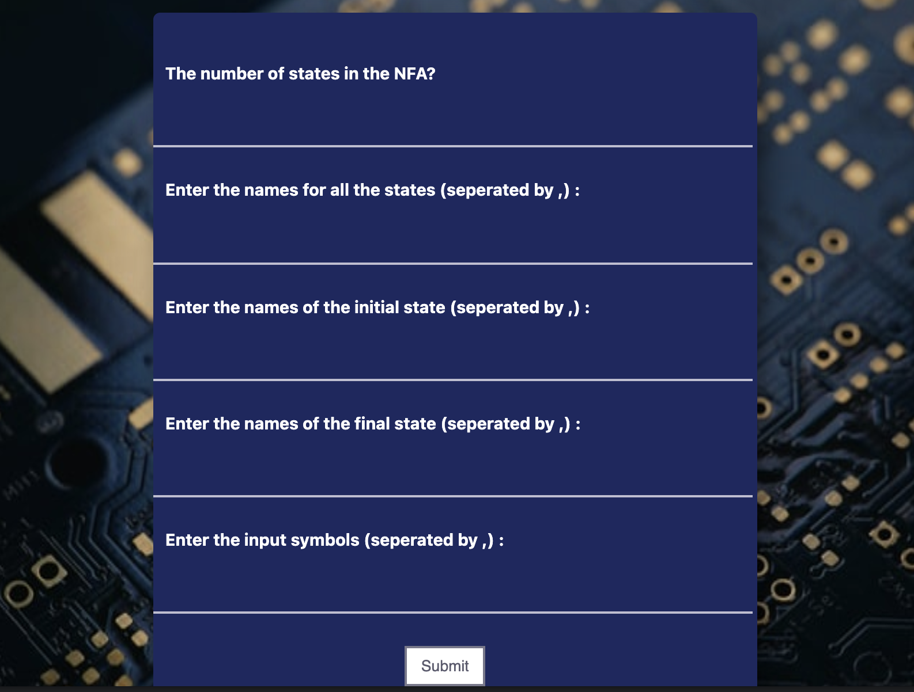

# NFA_to_DFA_Extension 

## Project Description
The project NFA_to_DFA_Extension is a chrome extension that computes the respective DFA (Deterministic finite automaton) for an NFA (Nondeterministic finite automaton). The extension requires the transition table of the NFA and then returns the transition table for the DFA.

## Technologies Used

- HTML -> Provides Structure to the User Interface.
- CSS -> Add Style to the User Interface
- JavaScript -> Used to implemement coversion logic and other functionalities.

## Steps for Installation
> 1. Clone the Repository.
> 1. Open any Chromium based web browser and go to the extensions menu of the web browser.
> 1. Turn on the 'Developer mode' and then click on load unpacked.
> 1. Select the folder with the cloned repository and you are good to go!
> 1. The project was tested on 'Brave Browser".
> 

## How to use the project?

> On the first page the user needs to provide:
> 1. Number of states in the NFA
> 1. List all the states (seperated by ,) example: q0,q1,q2
> 1. Enter the initial states (or states)
> 1. Enter the Final State (or states)
> 1. List the input symbols (seperated by ,) example: 0,1
>
## How to contribute to the Project?
## LICENSE
[MIT LICENSE](LICENSE.txt)

